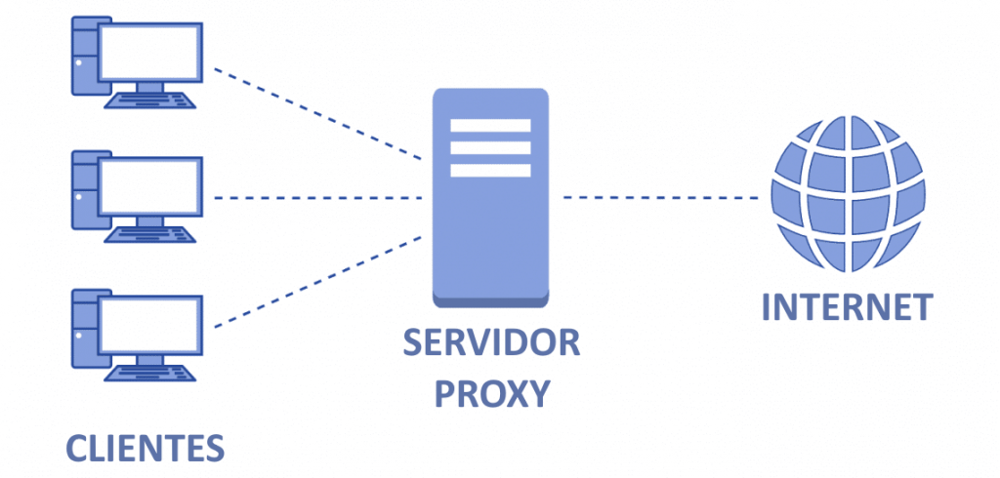
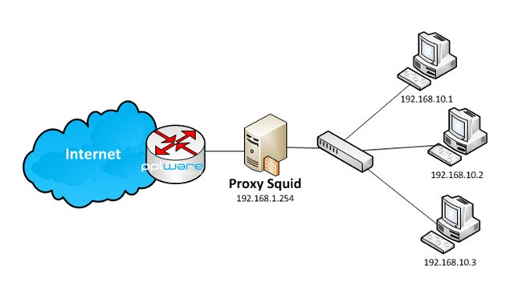

# Proxy

O que é um proxy?

Resposta: é um procurador. No caso da Internet, o mais comum é um proxy HTTP, que serve de "procurador" para clientes HTTP (Exemplos: Chrome, Edge, Safari, Firefox).

---

Na figura acima :point_up:, vemos um esquema geral de como funciona uma rede com proxy para se comunicar à Internet.

---

Na figura acima :point_up:, vemos um diagrama com a sequência de passos que incluem:

1. Entrada de uma URL pelo usuário
2. Solicitação da URL feita do navegador para o servidor proxy
3. Solicitação da URL feita do servidor proxy para o servidor web especificado pela URL
4. Recebimento do objeto de resposta, do servidor web para o servidor proxy
5. Encaminhamento do objeto do passo anterior, do servidor proxy para o navegador
6. Formatação do hipertexto pelo navegador e exibição do objeto para o usuário

---

Na figura acima :point_up:, temos um diagrama de redes com proxy, onde os equipamentos de rede que implementam a camada de rede estão identificados com seu respectivo endereço IPv4.

---

O servidor proxy mais comum é o Squid, sobre o qual trataremos nesta aula.

- [Instalação](instalacao.md)
- [Configuração](configuracao.md)
- [Listas de controle de acesso](listas.md)
- [Serviço](servico.md)
- [Log](log.md)

