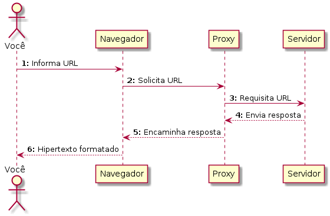

# Proxy

O que é um proxy?

Resposta: é um procurador. No caso da Internet, o mais comum é um proxy HTTP, que serve de "procurador" para clientes HTTP (Chrome, Edge, Safari, Firefox).

O servidor proxy mais comum é o Squid, sobre o qual trataremos nesta aula.

- [Instalação](instalacao.md)
- [Configuração](configuracao.md)
- [Listas de controle de acesso](acl.md)
- [Serviço](servico.md)
- [Log](log.md)

